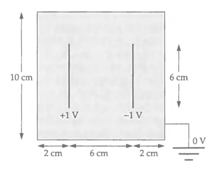

# Proyecto final - Física Computacional
## Modelo sencillo de un capacitor y su solución numérica (electrostática)

Este repositorio tiene como objetivo implementar métodos numéricos en la resolución de la ecuación de Laplace en dos dimensiones:

  

Para el potencial electrostático $\phi=\phi(x,y)$ En una placa cuadrada de $10cm \times 10cm$. El problema modela de forma ideal el capacitor
electronico que se presenta en la siguiente figura:

